# 免费VPS-Heroku搭建免费V2ray科学上网

## 一、在Heroku安装V2ray

链接：https://github.com/MillerRabins/v2ray-heroku 

直达链接：https://dashboard.heroku.com/new?template=https%3A%2F%2Fgithub.com%2Fbclswl0827%2Fv2ray-heroku

点击Deploy to Heroku，注册登录，邮箱推荐gmail邮箱，

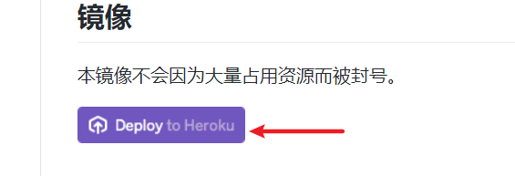

如果注册登录后没有如下页面，建议关闭重新进入即可。填写好App name、选择国家（建议美国），然后点击Deploy app，然后会自动进行app加载。

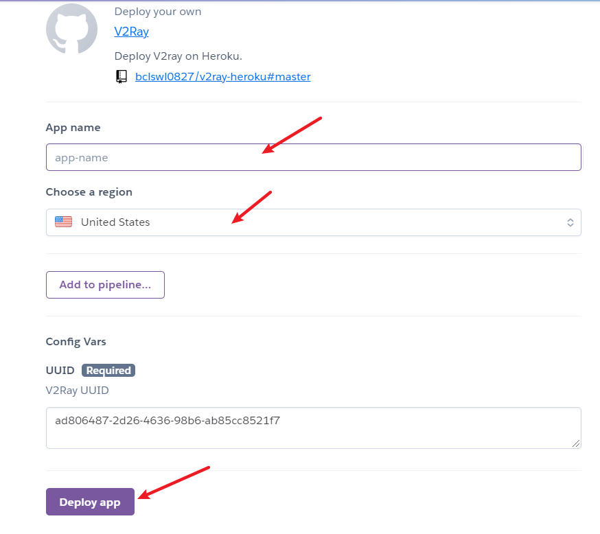

加载完成后，点击Manager App。

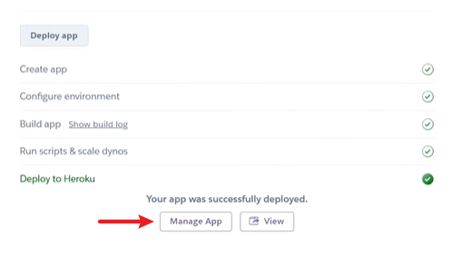

进入Settings设置页面，具有详细信息，记住Domains的一个链接，就是be found at后面的链接（https://**demo**/），端口为443。还有在此页面获取用户uuid，点击Reveal Config Vars，记住出现的uuid。

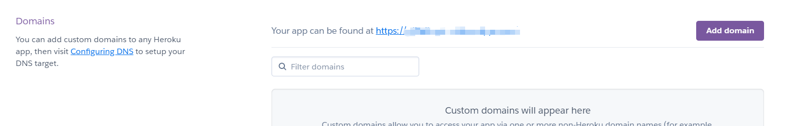

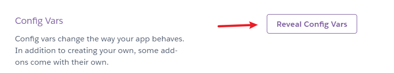

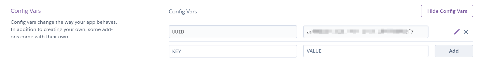

## 二、设置Cloudflare反代

链接：https://dash.cloudflare.com/login  

注册登录好，进入点击Workers，然后点击Create a Worker。

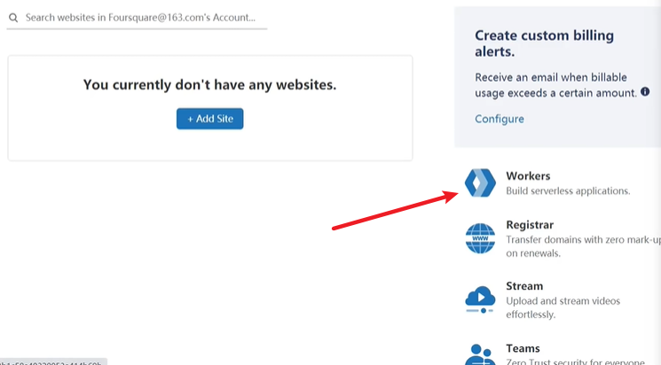

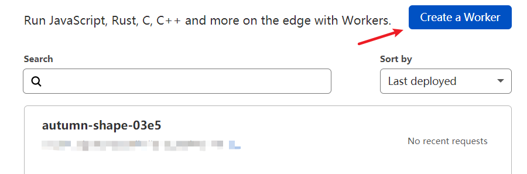

有如下页面，将Script内容清空，填入以下内容，将其中域名替换成https://**demo**/，并将https:// 与最后面的 / 去掉，不要有多的空格，如图。
```
addEventListener(
	"fetch",event => {
		let url=new URL(event.request.url);
		url.hostname="域名";
		let request=new Request(url,event.request);
		event. respondWith(
			fetch(request)
		)
	}
)
```

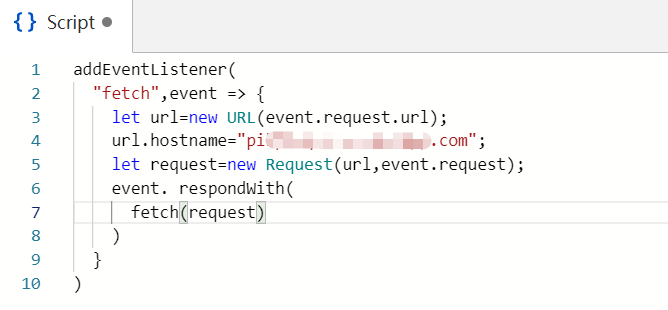

点击Save and Deploy（保存并部署），点击Send（发送），如果出现400则部署成功。

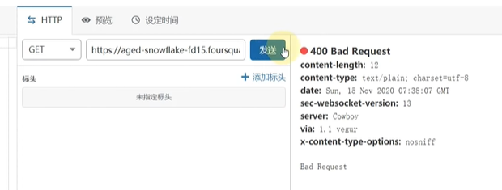

复制好图内GET后的https链接（https://demo2/）

## 三、查找Cloudflare最佳ip

链接：https://github.com/MillerRabins/better-cloudflare-ip

下载好对应系统版本的文件，打开，如果是win版本，则运行 CF优选IP.bat

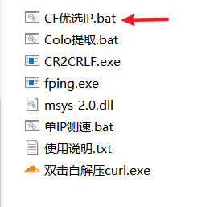

推荐选带宽40-50，如果选择高了，可能找不到符合要求的ip。


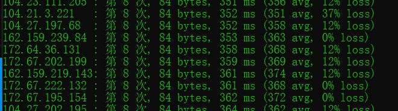


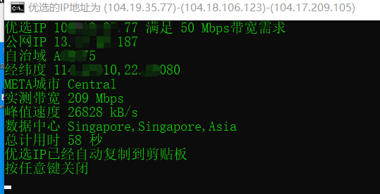

这已经将优质ip测试出来了。

然后打开v2ray，添加VMess服务器。

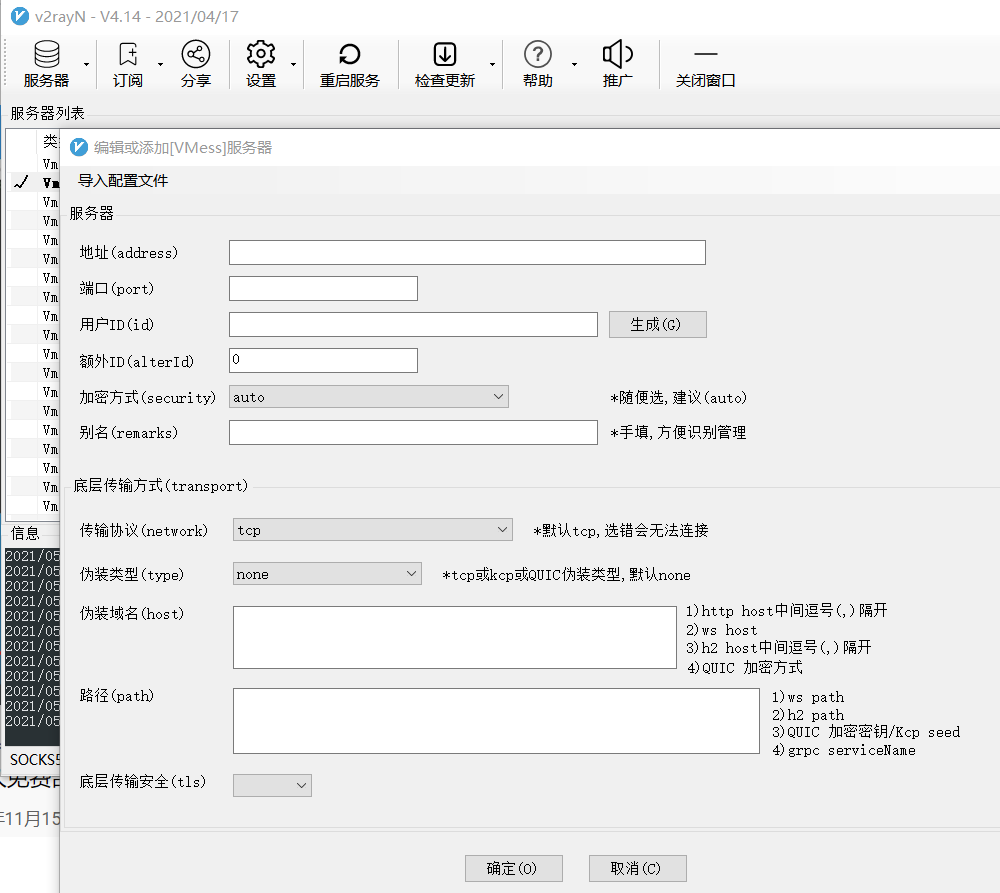

地址填写优选ip。

端口填写443。

用户（id）填写上步骤保存好的uuid。

传输协议更改为ws。

别名随意，一个标识。

伪装类型为none。

伪装域名为上步骤保存好的Get后面的长链接（https://demo2/），填入时去掉前面的https://与后面的/ ，只留下中加的demo2。

路径填写 /。

底层传输安全选择tls，跳过证书验证改为true.

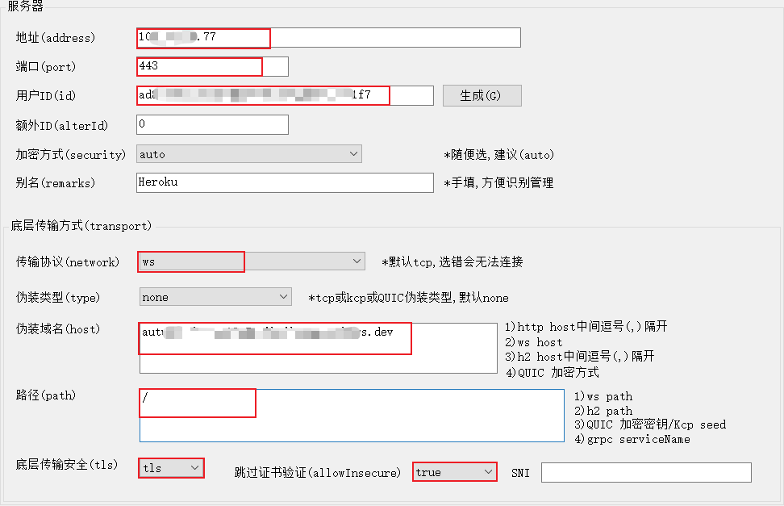

最后，选中节点，测试速度。

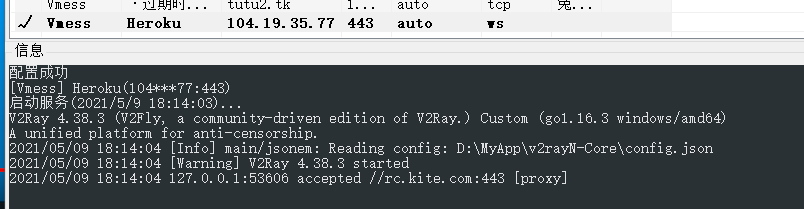


4K视频可以达到速度。

**！！！提醒！！！**

日常可以对付，但是不要薅羊毛薅过分，会被封。

用于在 Heroku 上部署 V2Ray Websocket。

**Heroku 为我们提供了免费的容器服务，我们不应该滥用它，所以本项目不宜做为长期翻墙使用。**

**可以部署两个以上的应用，实现 [负载均衡](https://toutyrater.github.io/routing/balance2.html)，避免长时间大流量连接某一应用而被 Heroku 判定为滥用。**

**Heroku 的网络并不稳定，部署前请三思。**

